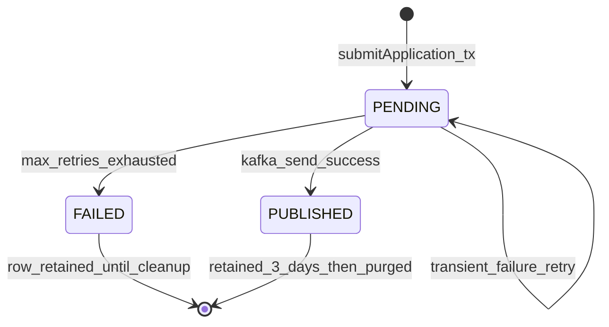
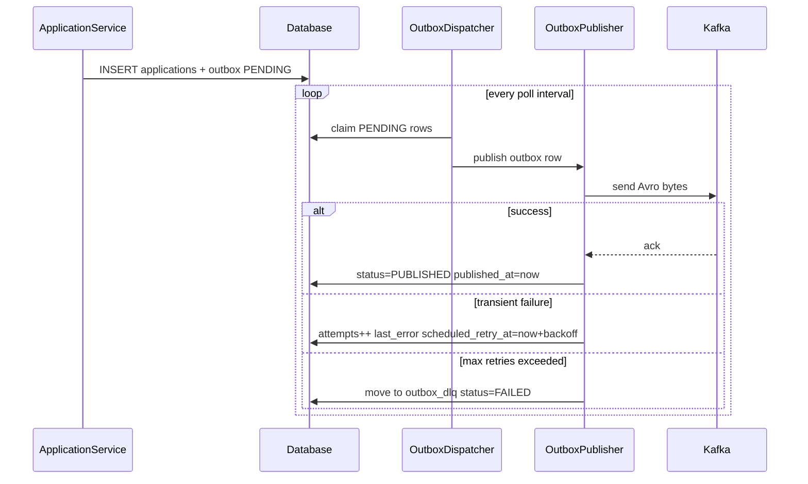

# 05 - Kafka & Outbox Design

## Overview

This document defines the event publishing system for the Application Submission service: Kafka producer configuration, transactional outbox dispatch, retry and dead-letter handling, retention cleanup, and replay. It is derived from Approved Decisions in `docs/01-requirements.md` and aligns with the architecture (`docs/02-architecture.md`), domain model (`docs/03-domain-model.md`), and API design (`docs/04-api-design.md`).

The REST API and domain model are **not** redesigned here. The service already persists an `Application` record and a corresponding `Outbox` row atomically on submission. This document specifies how a background dispatcher publishes those outbox rows to Kafka and manages their lifecycle.

**Delivery semantics:** at-least-once. Consumers must be idempotent and use `applicationId` as a deduplication key.

**Retry policy (confirmed):** 1 initial publish attempt + 3 retries (4 total attempts), with exponential backoff of 1s, 2s, and 4s after failures 1, 2, and 3 respectively.

## Implementation Status (as of 2026-06-16)


| Component                                         | Status                               |
| ------------------------------------------------- | ------------------------------------ |
| Transactional outbox write on submit              | Implemented                          |
| Avro schema + Maven code generation               | Implemented                          |
| `OutboxRepository.findPending`                    | Implemented                          |
| Outbox row claiming (concurrency-safe)            | Not started                          |
| `OutboxDispatcher` / `OutboxPublisher`            | Not started                          |
| Spring Kafka producer (`spring-kafka`)            | Not started                          |
| Retry / backoff                                   | Not started                          |
| Migrate to generated `ApplicationSubmitted` Avro  | Not started                          |
| DLQ move on exhausted retries                     | Not started                          |
| Retention cleanup jobs (3-day outbox, 30-day DLQ) | Not started                          |
| Admin replay / DLQ Swagger endpoints              | Not started                          |
| Kafka consumer                                    | Out of scope (producer-only service) |


## References

- `docs/01-requirements.md` — requirements and Approved Decisions (authoritative)
- `docs/02-architecture.md` — high-level architecture and sequence flows
- `docs/03-domain-model.md` — outbox/DLQ tables, Avro schema, claiming guidance
- `docs/04-api-design.md` — REST submission API (Kafka publish is not in the REST layer)

---

## Event Schema

### Topic


| Property      | Value                                                                  |
| ------------- | ---------------------------------------------------------------------- |
| Topic name    | `application-submitted`                                                |
| Partitions    | Default broker setting; partition key ensures per-application ordering |
| Partition key | `applicationId` (UUID string)                                          |
| Value format  | Avro binary (raw, no Confluent wire format)                            |


A single topic is used for all `ApplicationSubmitted` events (Approved Decision).

### Avro payload

Source of truth: `src/main/resources/avro/application-submitted-v1.avsc`

```json
{
  "type": "record",
  "name": "ApplicationSubmitted",
  "namespace": "com.example.event_driven_design_demo.events",
  "fields": [
    { "name": "applicationId", "type": "string" },
    { "name": "correlationId", "type": "string" },
    { "name": "timestamp", "type": "string" },
    { "name": "firstName", "type": "string" },
    { "name": "lastName", "type": "string" },
    { "name": "version", "type": "int", "default": 1 }
  ]
}
```


| Field           | Type   | Notes                                     |
| --------------- | ------ | ----------------------------------------- |
| `applicationId` | string | UUID; also used as Kafka record key       |
| `correlationId` | string | UUID; request-scoped trace id             |
| `timestamp`     | string | ISO-8601 UTC (e.g. `Instant.toString()`)  |
| `firstName`     | string | From submitted application                |
| `lastName`      | string | From submitted application                |
| `version`       | int    | Schema version; default `1` for v1 schema |


### Encoding and schema management

- **Serialization:** Avro binary encoding stored in `outbox.payload` with `content_type = avro/binary`.
- **Schema registry:** Not used. Schemas are stored in-repo under `src/main/resources/avro/` with semantic versioning in filenames (`application-submitted-v1.avsc`, `application-submitted-v2.avsc`, etc.).
- **Schema version in DB:** No `schema_version` column on outbox rows; version is implied by the Avro file and the `version` field in the payload.
- **Evolution:** New schema files require CI compatibility checks before merge (when CI is added). Producers and consumers must agree on schema version out-of-band.
- **Java serialization (Approved Decision):** Use the generated `com.example.event_driven_design_demo.events.ApplicationSubmitted` class from `avro-maven-plugin` for all Avro serialization. Migrate `ApplicationServiceImpl` (currently `GenericRecord`) and any replay/fallback code that constructs events. The outbox publisher sends stored `outbox.payload` bytes as-is during normal dispatch; the generated class is used at write time and for application-table fallback replay.

### Kafka record headers

Headers allow tracing and routing without deserializing the Avro payload:


| Header          | Value                  | Purpose                                  |
| --------------- | ---------------------- | ---------------------------------------- |
| `correlationId` | UUID string            | Distributed tracing / log correlation    |
| `applicationId` | UUID string            | Redundant with key; aids log correlation |
| `eventType`     | `ApplicationSubmitted` | Event identification                     |
| `schemaVersion` | `1`                    | Matches Avro file version                |


### Consumer contract

- Delivery is **at-least-once**. Duplicate messages are possible on retry or replay.
- Consumers **must** deduplicate on `applicationId` (Approved Decision).
- Events for the same `applicationId` are ordered within a partition because `applicationId` is the partition key.
- Consumers must deserialize raw Avro binary using the in-repo schema file (or a copy distributed to consumer teams).

---

## Outbox Flow

### State machine




| Status      | Meaning                                                        |
| ----------- | -------------------------------------------------------------- |
| `PENDING`   | Awaiting publish or scheduled for retry                        |
| `PUBLISHED` | Successfully sent to Kafka; retained for audit/replay (3 days) |
| `FAILED`    | All retries exhausted; payload copied to `outbox_dlq`          |


### Happy path

1. Client calls `POST /applications`.
2. `ApplicationServiceImpl` persists `applications` and `outbox` in a **single DB transaction**:
  - `outbox.status = PENDING`
  - `outbox.attempts = 0`
  - `outbox.scheduled_retry_at = now()`
  - `outbox.payload` = Avro-encoded `ApplicationSubmitted`
3. API returns `201 Created` immediately (eventual consistency with Kafka).
4. `OutboxDispatcher` polls for eligible rows (`status = PENDING` AND `scheduled_retry_at <= now()`).
5. Dispatcher atomically **claims** rows (see Claiming strategy below).
6. `OutboxPublisher` sends payload to topic `application-submitted` with key `applicationId`.
7. On Kafka ack success:
  - `outbox.status = PUBLISHED`
  - `outbox.published_at = now()`
  - Row retained for 3 days, then purged by cleanup job.

### Publish / retry sequence




### Claiming strategy (concurrency-safe)

Multiple service instances may run the dispatcher. Claiming must prevent double-processing of the same outbox row.

**PostgreSQL (production target):**

```sql
SELECT id FROM outbox
WHERE status = 'PENDING' AND scheduled_retry_at <= :now
ORDER BY id
LIMIT :batchSize
FOR UPDATE SKIP LOCKED
```

Claimed rows are processed within the same transaction or immediately after selection under a short-lived lock. On success or failure the row is updated and the transaction commits, releasing the lock.

**H2 (local development):**

- Single-instance assumption; use the existing JPA query `OutboxRepository.findPending(now)` without `SKIP LOCKED`.
- Documented limitation: concurrent multi-instance correctness is not guaranteed on H2.
- Concurrency integration tests should use Testcontainers with PostgreSQL.

### Eligibility query

Reuse the existing repository method semantics:

```java
SELECT o FROM Outbox o
WHERE o.status = 'PENDING' AND o.scheduledRetryAt <= :now
ORDER BY o.id
```

Only `PENDING` rows whose retry schedule has elapsed are candidates for processing.

---

## Publisher Design

### Components


| Component             | Package (proposed) | Responsibility                                                    |
| --------------------- | ------------------ | ----------------------------------------------------------------- |
| `OutboxDispatcher`    | `...outbox`        | `@Scheduled` poller; claims a batch and invokes publisher per row |
| `OutboxPublisher`     | `...outbox`        | Sends Avro bytes via `KafkaTemplate`; sets record key and headers |
| `OutboxClaimService`  | `...outbox`        | Atomic row claiming (Postgres `SKIP LOCKED` / H2 fallback)        |
| `OutboxRetryPolicy`   | `...outbox`        | Computes `scheduled_retry_at` from current `attempts`             |
| `OutboxDlqService`    | `...outbox`        | Copies exhausted rows to `outbox_dlq`, marks outbox `FAILED`      |
| `OutboxCleanupJob`    | `...outbox`        | Daily purge of old published outbox rows and DLQ rows             |
| `OutboxReplayService` | `...outbox`        | Operator-triggered replay from outbox or DLQ                      |


### Dispatcher behavior


| Setting          | Local (H2)              | DEV / TEST / PROD                              |
| ---------------- | ----------------------- | ---------------------------------------------- |
| Poll interval    | 5000 ms (`fixedDelay`)  | Configurable; tune based on TPS                |
| Batch size       | 50 rows per poll        | Configurable; typically higher than local      |
| Processing model | Sequential within batch | Sequential within batch                        |

Local defaults use a longer poll interval to reduce load on the embedded H2 database. Deployed environments override via config (e.g. `OUTBOX_DISPATCHER_FIXED_DELAY_MS`, `OUTBOX_DISPATCHER_BATCH_SIZE`).


Each poll cycle:

1. Claim up to `batchSize` eligible rows.
2. For each row, invoke `OutboxPublisher.publish(outbox)`.
3. On success → mark `PUBLISHED`.
4. On failure → apply retry policy or move to DLQ.
5. Log every attempt with `correlationId`, `applicationId`, `outboxId`, and attempt number.

### Kafka producer configuration

Add `spring-kafka` dependency and configure:

```yaml
spring:
  kafka:
    bootstrap-servers: ${KAFKA_BOOTSTRAP_SERVERS:localhost:9092}
    producer:
      key-serializer: org.apache.kafka.common.serialization.StringSerializer
      value-serializer: org.apache.kafka.common.serialization.ByteArraySerializer
      acks: all
      retries: 0          # outbox owns retry semantics; disable client auto-retry
      properties:
        linger.ms: 5
        batch.size: 16384

outbox:
  dispatcher:
    fixed-delay-ms: 5000   # local default; lower TPS load on H2
    batch-size: 50         # local default
  topic:
    application-submitted: application-submitted
```

**Design rationale:**

- `acks: all` — wait for all in-sync replicas to acknowledge (durability).
- `retries: 0` — prevent duplicate sends at the Kafka client layer; the outbox table is the single source of retry state.
- `ByteArraySerializer` — send pre-serialized Avro bytes from `outbox.payload` without re-encoding.

**Circuit breaker:** Not used for Kafka outbox publishing (Approved Decision). Publish failures are handled exclusively via outbox retry/backoff and DLQ. Resilience4j (`spring-cloud-starter-circuitbreaker-reactor-resilience4j` on the classpath) is reserved for REST API resilience only.

### Kafka topic provisioning

| Environment | Approach |
|-------------|----------|
| Local dev / integration tests | Pre-provision topic `application-submitted` in Testcontainers Kafka setup |
| DEV / UAT / PROD | Topics pre-provisioned by infrastructure; application assumes topic exists |

- Testcontainers is used for local development and integration testing only; deployed environments do not use Testcontainers.
- Do not rely on broker auto-create for production paths.

### OutboxPublisher send contract

```
topic:     application-submitted
key:       outbox.applicationId.toString()
value:     outbox.payload (byte[])
headers:   correlationId, applicationId, eventType, schemaVersion
```

The publisher does **not** re-serialize from the `applications` table during normal dispatch; it sends the stored payload as-is to preserve exactly what was enqueued at submission time.

### Logging

Every publish attempt must log (structured):

- `correlationId`
- `applicationId`
- `outboxId`
- `attempt` (current attempt number)
- `status` (success / retry / dlq)
- `error` (on failure)

---

## Retry Strategy

### Attempt model


| Attempt # | Description     | On failure                         |
| --------- | --------------- | ---------------------------------- |
| 1         | Initial publish | `attempts = 1`, retry after **1s** |
| 2         | First retry     | `attempts = 2`, retry after **2s** |
| 3         | Second retry    | `attempts = 3`, retry after **4s** |
| 4         | Third retry     | Move to DLQ, mark outbox `FAILED`  |


- `attempts` starts at `0` when the outbox row is created.
- `attempts` increments on each **failed** send only.
- A successful send does not increment `attempts` further; row transitions directly to `PUBLISHED`.
- After attempt 4 fails, no further automatic retries occur.

### Backoff calculation

```
backoff(attempts) =
  1 second  when attempts == 1
  2 seconds when attempts == 2
  4 seconds when attempts == 3
```

Implementation:

```
scheduled_retry_at = Instant.now().plusSeconds(backoffSeconds)
last_error         = truncated exception message / root cause
```

Rows with a future `scheduled_retry_at` are excluded from the eligibility query until the backoff elapses.

### Transient vs permanent failures


| Category  | Examples                                             | Handling                                                                |
| --------- | ---------------------------------------------------- | ----------------------------------------------------------------------- |
| Transient | Network timeout, broker unavailable, leader election | Retry with backoff                                                      |
| Permanent | Corrupt payload, serialization error at send time    | Retry up to max, then DLQ (should not occur if outbox write is correct) |


Both categories follow the same retry/DLQ path. Permanent failures surface in DLQ for operator inspection.

---

## Failure Handling

### DLQ move (after 4 failed attempts)

When `attempts` reaches 3 and the next send also fails (4th total attempt):

1. Insert a row into `outbox_dlq`:
  - `original_outbox_id` = outbox.id
  - `application_id` = outbox.applicationId
  - `correlation_id` = outbox.correlationId
  - `payload` = outbox.payload (copy)
  - `failure_reason` = last error message
  - `attempts` = outbox.attempts
  - `failed_at` = now()
  - `created_at` = now()
2. Update outbox row: `status = FAILED`.
3. Log at ERROR with `correlationId`, `applicationId`, `outboxId`, and `failure_reason`.

The original outbox row is retained (not deleted) until the cleanup policy applies.

### Operator visibility

- Structured ERROR logs on DLQ move.
- Future Swagger admin endpoints to list and inspect DLQ items (see Replay design).
- System is designed to allow future metrics (`publishAttempts`, `failedPublishes`, `retries`, `dlqCount`) without requiring them for this exercise.

### Retention and cleanup


| Store                | Retention                                                                     | Cleanup trigger     |
| -------------------- | ----------------------------------------------------------------------------- | ------------------- |
| Outbox (`PUBLISHED`) | 3 days after `published_at`                                                   | Daily scheduled job |
| Outbox (`FAILED`)    | Until DLQ move completes; then subject to same cleanup as other terminal rows |                     |
| Outbox (`PENDING`)   | Not purged (active work)                                                      | —                   |
| `outbox_dlq`         | 30 days after `failed_at`                                                     | Daily scheduled job |


**Cleanup job (`OutboxCleanupJob`):**

```
DELETE FROM outbox
WHERE status = 'PUBLISHED' AND published_at < now() - interval '3 days'

DELETE FROM outbox_dlq
WHERE failed_at < now() - interval '30 days'
```

Run once daily (e.g. `@Scheduled(cron = "0 0 2 * * *")` — 02:00 UTC).

---

## Replay Design

### Replay paths


| Path                 | Trigger  | Source                                                  | Notes                                                               |
| -------------------- | -------- | ------------------------------------------------------- | ------------------------------------------------------------------- |
| Automatic retry      | System   | `outbox` (`PENDING`)                                    | Standard dispatcher flow when `scheduled_retry_at <= now()`         |
| Manual outbox replay | Operator | `outbox` (`PUBLISHED` or `FAILED`, within 3-day window) | Re-publish stored Avro payload                                      |
| Manual DLQ replay    | Operator | `outbox_dlq`                                            | Re-publish stored payload after operator review                     |
| Application fallback | Operator | `applications` table                                    | When outbox row no longer exists (> 3 days); reconstruct Avro event |


### Manual replay behavior

**From outbox row:**

1. Operator selects an outbox row via admin endpoint.
2. System re-publishes `outbox.payload` to `application-submitted` with key `applicationId`.
3. On success: log replay action with operator context; optionally update `published_at` if row is still `PUBLISHED`.
4. At-least-once semantics apply; consumers must deduplicate on `applicationId`.

**From DLQ row (Approved Decision):**

1. Operator selects a DLQ entry via admin endpoint.
2. System re-publishes `outbox_dlq.payload` **directly to Kafka** (same key and headers). Does **not** reset the original outbox row to `PENDING`.
3. Structured audit log with `dlqId`, `applicationId`, `correlationId`, timestamp, and operator context.
4. Optionally mark DLQ row as replayed (future enhancement; not required for initial implementation).

**From applications table (fallback after retention):**

1. Operator provides `applicationId`.
2. System reads `applications` row and re-serializes an `ApplicationSubmitted` Avro event using the generated `ApplicationSubmitted` class.
3. Publishes to Kafka with `applicationId` as partition key.
4. Does not recreate an outbox row unless audit trail is required.

### Ordering on replay

Always use `applicationId` as the Kafka partition key. Replays for the same application land on the same partition, preserving per-application ordering.

### Proposed admin endpoints

These endpoints are part of the event-system tooling scope and will be implemented separately from the submission API (`docs/04-api-design.md`):


| Method | Path                            | Description                     |
| ------ | ------------------------------- | ------------------------------- |
| GET    | `/admin/outbox-dlq`             | List DLQ items (paginated)      |
| GET    | `/admin/outbox-dlq/{id}`        | DLQ item detail                 |
| POST   | `/admin/outbox-dlq/{id}/replay` | Trigger replay from DLQ payload |
| POST   | `/admin/outbox/{id}/replay`     | Trigger replay from outbox row  |


Request/response DTOs are deferred to a future admin API document (see Deferred section below). Endpoint paths above are confirmed.

---

## Event Lifecycle Summary


| Phase       | Trigger            | Outbox status            | Kafka             | Retention          |
| ----------- | ------------------ | ------------------------ | ----------------- | ------------------ |
| Enqueue     | API submit         | `PENDING`                | Not yet published | —                  |
| Publish     | Dispatcher success | `PUBLISHED`              | Message on topic  | Outbox kept 3 days |
| Retry       | Transient failure  | `PENDING` (`attempts++`) | —                 | —                  |
| Dead letter | 4th attempt fails  | `FAILED` + DLQ row       | —                 | DLQ kept 30 days   |
| Purge       | Cleanup job        | Deleted                  | —                 | —                  |


End-to-end flow:

```
POST /applications
  → DB transaction (applications + outbox PENDING)
  → 201 Created (immediate response)
  → [async] Dispatcher claims row
  → [async] Publish to Kafka
  → [async] PUBLISHED (or retry, or DLQ)
  → [daily] Cleanup purges old rows
```

---

## Approved Decisions (Kafka & Outbox)

The following items were resolved from the initial Open Questions review (2026-06-16):

1. **Circuit breaker** — Not used for Kafka outbox publishing. Resilience4j circuit breaker applies to REST APIs only. Kafka publish failures are handled via outbox retry/backoff and DLQ.

2. **Dispatcher tuning** — Local (H2): poll interval **5000 ms**, batch size **50**. DEV/TEST/PROD: both values configurable and tuned upward based on TPS.

3. **DLQ manual replay** — Direct Kafka publish from DLQ payload with structured audit logging. Does not reset outbox row to `PENDING`.

4. **Kafka topic provisioning** — Pre-provision `application-submitted` in Testcontainers for local dev and integration tests. DEV/UAT/PROD topics pre-provisioned by infrastructure (no Testcontainers).

5. **Avro serialization** — Migrate to generated `ApplicationSubmitted` class from `avro-maven-plugin` for all serialization (service write path and replay/fallback code).

## Deferred

- **Admin API contract** — Exact request/response DTOs for DLQ list, detail, and replay endpoints. Endpoint paths are documented above; shapes deferred to a future admin API document.

---

## Implementation Backlog

Implementation proceeds in this order (aligned with `docs/02-architecture.md`):

1. Add `spring-kafka` dependency and producer configuration in `application.yml`.
2. Migrate `ApplicationServiceImpl` from `GenericRecord` to generated `ApplicationSubmitted`.
3. Implement `OutboxClaimService` with Postgres `SKIP LOCKED` and H2 fallback.
4. Implement `OutboxPublisher` and `OutboxDispatcher` with retry/backoff (no circuit breaker on Kafka path).
5. Implement `OutboxDlqService` for exhausted retry handling.
6. Implement `OutboxCleanupJob` for 3-day / 30-day retention.
7. Implement admin replay endpoints and Swagger documentation.
8. Add integration tests with Testcontainers (PostgreSQL + Kafka; pre-provision `application-submitted` topic).

---

References

- `docs/01-requirements.md` (Approved Decisions — authoritative)
- `docs/02-architecture.md`
- `docs/03-domain-model.md`
- `docs/04-api-design.md`
- `src/main/resources/avro/application-submitted-v1.avsc`

