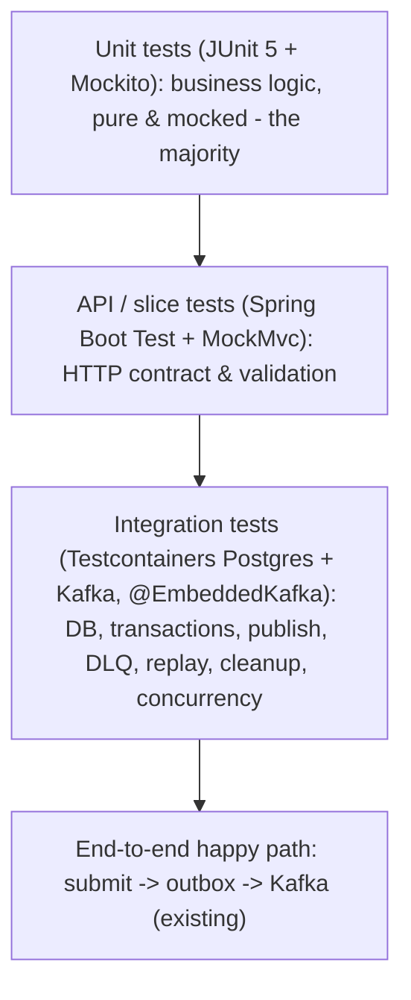

# 07 - Test Strategy

## Purpose and scope

This document is the authoritative testing specification for the Application Submission service. It defines WHAT should be tested, HOW it should be tested, WHICH technologies to use, and WHICH classes require automated tests. It is consumed by the Test Implementation Engineer.

This document contains NO test code. It is a specification only. Recommended libraries (Testcontainers, JaCoCo, etc.) are recommendations; adding them to `pom.xml` is an implementation step performed only after this strategy is approved.

It is derived from and must remain consistent with the approved documents:

- `docs/01-requirements.md` (requirements and Approved Decisions - authoritative)
- `docs/02-architecture.md`
- `docs/03-domain-model.md`
- `docs/04-api-design.md`
- `docs/05-kafka-outbox-design.md`
- `docs/06-resilience-design.md`

## Decision-rule review (Open Questions / Approved Decisions)

Per the Test Strategy Architect rules, the approved inputs were reviewed before writing this strategy:

- Requirements Open Question #15 (Testing expectations) has an Approved Decision: the system must be testable with integration tests against a local Kafka instance (Testcontainers or local Kafka executables) and an in-memory database (H2). This resolves testing scope; there are no blocking Open Questions for this strategy.
- Testcontainers execution model: the "opt-in Testcontainers" approach is an Approved Decision (see [Approved Decisions](#approved-decisions)). The default build (`mvn test`) runs only fast, Docker-free tests (unit + `@EmbeddedKafka`); Docker-dependent Testcontainers tests are tagged and excluded by default, and run only when explicitly enabled. This resolves former Open Questions #1, #3, and #4.
- The following Approved Decisions are treated as FINAL and are validated (not re-decided) by the tests below:
  - Retry model: 1 initial attempt + 3 retries (4 total), exponential backoff 1s, 2s, 4s.
  - DLQ move after the 4th failed attempt; outbox row marked `FAILED`.
  - Retention: published outbox rows 3 days, DLQ rows 30 days; daily cleanup job.
  - Ordering: `applicationId` is the Kafka partition key (per-application ordering).
  - Delivery: at-least-once; consumers must be idempotent using `applicationId` (consumer is out of scope - producer-only service).
  - Serialization: Avro binary via the generated `ApplicationSubmitted` class and `ApplicationSubmittedSerializer`; no schema registry.
  - Resilience4j applies to the synchronous DB submit path and background outbox DB jobs (and, in future, REST/outbound HTTP) - NOT to Kafka outbox publishing, which uses the outbox retry/backoff/DLQ path.
  - Validation: `firstName`/`lastName` mandatory, max 50, regex `^[\p{L}]+(?:[ '\-][\p{L}]+)*$`.
  - Error contract: `{ errorCode, message }`; 400 `VALIDATION_ERROR`, 404 `NOT_FOUND`, 500 `INTERNAL_ERROR`, 503 `SERVICE_UNAVAILABLE`.

Any additional testing assumptions requiring confirmation are recorded in [Open Questions](#open-questions).

---

## Test Strategy

### Philosophy

The service is an event-driven system whose correctness is dominated by asynchronous, failure-path, and concurrency behavior rather than by simple request/response mapping. The strategy therefore emphasizes:

1. Fast, deterministic unit tests for all business logic (retry/backoff decisions, DLQ transitions, serialization, orchestration, exception mapping). These are the first line of defense and must not require Spring, a database, or Kafka.
2. Integration tests at real boundaries (database, Kafka) to validate transaction atomicity, concurrency-safe outbox retrieval, publishing, retention, and replay - the behaviors that unit tests structurally cannot prove.
3. API tests that lock the HTTP contract (status codes, payloads, validation, error shape).
4. Resilience tests that prove the Resilience4j retry/circuit-breaker behavior and the outbox retry/backoff/DLQ behavior against the approved policies.

### Test pyramid for this service



### Guiding principles

- Business logic is unit-tested in isolation with mocked collaborators; no I/O.
- Integration tests own everything that depends on real transaction/lock/serialization semantics; PostgreSQL is used where H2 and Postgres diverge (notably `FOR UPDATE SKIP LOCKED`).
- Asynchronous assertions use Awaitility with bounded timeouts; no `Thread.sleep`.
- The scheduled dispatcher/cleanup jobs are disabled by default in tests and invoked explicitly, so tests are deterministic (the existing suite already sets `outbox.dispatcher.enabled=false`).
- Tests assert on the approved contracts (error codes, retry counts, backoff, retention windows), so a regression against a design decision fails a test.
- Testcontainers is opt-in (default-off): Docker-dependent tests are tagged `@Tag("testcontainers")` and excluded from the default `mvn test` run so the everyday build stays fast and Docker-free. They run only when explicitly enabled (see [Testcontainers usage](#testcontainers-usage) and [Approved Decisions](#approved-decisions)).

### Recommended testing technologies

| Concern | Technology | Notes |
|---|---|---|
| Unit test framework | JUnit 5 (Jupiter) | Already available via `spring-boot-starter-test`. |
| Mocking | Mockito | Available via `spring-boot-starter-test`. |
| Assertions | AssertJ | Available; already used. |
| Async assertions | Awaitility | Already a test dependency. |
| API tests | Spring Boot Test + MockMvc | `MockMvc` for the servlet controllers; `WebTestClient` not needed (controllers are MVC, not reactive). |
| Kafka integration | `@EmbeddedKafka` (spring-kafka-test) is the default; Testcontainers Kafka is opt-in for prod parity | `@EmbeddedKafka` runs in the default build (no Docker). Testcontainers Kafka is tagged `@Tag("testcontainers")` and off by default. |
| Database integration | Testcontainers PostgreSQL (opt-in) | Required for concurrency (`SKIP LOCKED`) and Postgres-parity tests. Tagged `@Tag("testcontainers")`, excluded by default, and gracefully skipped when Docker is absent. |
| Opt-in gating | JUnit 5 `@Tag` + Maven Surefire `excludedGroups` + `testcontainers` profile + `@Testcontainers(disabledWithoutDocker = true)` | Default `mvn test` excludes the `testcontainers` group; `mvn test -Ptestcontainers` (or a Docker-enabled CI job) includes it. |
| Coverage | JaCoCo | Recommend adding the Maven plugin with business-logic-focused goals. |
| Service virtualization | Hoverfly | Not required today (no outbound HTTP). Reserved for future outbound integrations. |

---

## Unit Test Plan

Scope: only classes containing business logic (branching, calculation, orchestration, error handling). DTOs, entities, enums, configuration/constants classes, repository interfaces, exception classes, and the application bootstrap class are intentionally excluded per the testing preferences.

### Classes that SHOULD receive unit tests

| Class | Why it needs unit tests | Key scenarios to validate |
|---|---|---|
| `OutboxRetryPolicy` (`outbox/dispatch`) | Pure, branch-heavy policy at the heart of retry/DLQ correctness; zero dependencies, highest leverage. | `shouldMoveToDlq(n)` returns false for 1-3 and true for >3 (boundary at 3/4). `nextRetryAt(1)`=+1s, `(2)`=+2s, `(3)`=+4s. Invalid attempts (0, 4+, negative) throw `IllegalArgumentException`. |
| `OutboxProcessor` (`outbox/dispatch`) | Core failure-handling branching: success vs transient failure vs DLQ; attempt increment; error truncation. | Successful publish -> `markPublished` (status PUBLISHED, `publishedAt` set, saved). Publish throws `OutboxPublishException` -> attempts incremented, `lastError` set. Failure with `newAttempts` still retryable -> `scheduledRetryAt` set from policy, saved, DLQ not called. Failure that exhausts retries -> `dlqService.moveToDlq` invoked and no further save. `truncateError` uses cause, falls back to class name when message null, caps at 4000 chars. |
| `OutboxDlqService` (`outbox/dlq`) | Builds the DLQ row and mutates outbox state; correctness of the terminal transition. | Copies `applicationId`/`correlationId`/`payload`/`attempts`, sets `failedAt`/`createdAt`, truncates `failureReason` to 4000; source event marked `FAILED` and saved; both repositories invoked. |
| `OutboxReplayService` (`outbox/replay`) | Eligibility branching and three distinct replay flows. | `replayOutbox`: status PUBLISHED or FAILED -> republish; any other status -> `OutboxReplayException`. `replayDlq`: republishes DLQ payload. `replayFromApplication`: re-serializes via serializer then republishes. Verifies publisher called with correct payload/key. |
| `OutboxReplayReader` (`outbox/replay`) | `orElseThrow` branching for each lookup. | `findOutboxEvent`/`findDlq`/`findApplication` return entity when present; throw `OutboxReplayException` when absent. (Resilience annotations verified in the resilience/integration layer, not here.) |
| `ApplicationSubmittedSerializer` (`serialization`) | Serialization logic and error wrapping; null-field risk. | Serializes a populated `Application`/`ApplicationSubmitted` to non-empty Avro bytes that round-trip back to the same field values. `IOException` path surfaces as `IllegalStateException`. Null required field behavior documented/asserted (NPE risk on `applicationId`/`createdAt`). |
| `ApplicationServiceImpl` (`service/impl`) | Orchestration of the transactional write path. | Generates UUID `applicationId`/`correlationId` and `timestamp`; persists `Application` (status SUBMITTED) and an `OutboxEvent` (PENDING, attempts=0, `scheduledRetryAt`=now) using the serialized payload; returns an `ApplicationResponse` whose fields match the persisted values. Both repository saves occur. |
| `OutboxPublisher` (`outbox/publish`) | Kafka record assembly and failure wrapping (mock `KafkaTemplate`). | Builds `ProducerRecord` with topic from properties, key = `applicationId`, value = payload bytes, and 4 headers (`correlationId`, `applicationId`, `eventType=ApplicationSubmitted`, `schemaVersion=1`). Successful send returns normally. `ExecutionException`/`TimeoutException` -> `OutboxPublishException`. `InterruptedException` -> interrupt flag re-set and `OutboxPublishException` thrown. |
| `OutboxRetrievalService` (`outbox/dispatch`) | Dialect branch (Postgres native `SKIP LOCKED` vs H2 JPA). | With Postgres platform configured -> native `FOR UPDATE SKIP LOCKED` query path used. With H2 -> `OutboxRepository.findPending(now, PageRequest)` path used. Branch selection driven by `spring.jpa.database-platform`. |
| `OutboxDispatchService` (`outbox/dispatch`) | Batch orchestration and returned count. | Reads batch size from `OutboxProperties`; retrieves N pending events; invokes `processor.processOutbox` for each; returns processed count. Empty batch -> 0, no processing. |
| `OutboxCleanupJob` (`outbox/cleanup`) | Retention cutoff calculation and delete orchestration. | Computes `publishedCutoff = now - 3 days` and `dlqCutoff = now - 30 days` from properties; calls `deletePublishedBefore` and `deleteFailedBefore` with those cutoffs; logs counts. |
| `GlobalExceptionHandler` (`exception`) | Exception-to-HTTP mapping; central to the error contract. | `MethodArgumentNotValidException` and `ConstraintViolationException` -> 400 `VALIDATION_ERROR`. `OutboxReplayException` -> 404 `NOT_FOUND`. `CallNotPermittedException` -> 503 `SERVICE_UNAVAILABLE`. `TransientDataAccessException`/`DataAccessResourceFailureException` -> 503. Generic `Exception` -> 500 `INTERNAL_ERROR`. (Can be exercised as pure unit tests over the handler methods; the HTTP wiring is additionally covered by API tests.) |
| `OutboxAdminController` (`controller`) | Entity->DTO mapping and `orElseThrow` branch (beyond thin delegation). | Primarily covered via MockMvc API tests (below); the private `toResponse` mapping and 404 branch are the logic worth asserting. |

Note: `OutboxDispatcher` (the `@Scheduled` poller) and `ApplicationController` are thin; their meaningful behavior is verified at the integration/API level rather than with isolated unit tests, though a light unit test of the dispatcher's exception-swallowing behavior is optional.

### Classes intentionally EXCLUDED from unit tests

Per the stated preferences, the following are not unit tested (no meaningful branching logic):

- DTOs / records: `ApplicationRequest`, `ApplicationResponse`, `OutboxDlqResponse`, `ReplayResponse`, `ApiError`.
- Entities: `Application`, `OutboxEvent`, `OutboxDlq`.
- Enums: `ApplicationStatus`, `OutboxStatus`.
- Configuration / constants / annotations: `KafkaProducerConfig`, `OpenApiConfig`, `OutboxProperties`, `ResilienceInstanceNames`, `StandardServerErrorResponses`, `EventDrivenDesignDemoApplication`.
- Repository interfaces: `ApplicationRepository`, `OutboxRepository`, `OutboxDlqRepository` (custom queries are validated in integration tests, not unit tests).
- Exception classes: `OutboxPublishException`, `OutboxReplayException`.
- Lombok-generated methods (getters/setters/builders) on any class.

Validation annotations on `ApplicationRequest` are exercised indirectly through the API tests rather than by unit-testing the DTO itself.

---

## Integration Test Plan

Integration tests validate behavior that unit tests cannot: real transactions, database locking/concurrency, Kafka publishing, and scheduled cleanup.

### Integration boundaries

1. Database (persistence + transactions)
   - Atomic write: `submitApplication` persists both the `applications` row and the `outbox` row (PENDING) in one transaction; on a forced failure after the first save, neither row is committed.
   - Repository queries: `OutboxRepository.findPending` returns only PENDING rows whose `scheduledRetryAt <= now`, ordered by id; `deletePublishedBefore` and `deleteFailedBefore` delete only rows past the cutoff.
   - Concurrency-safe retrieval: with PostgreSQL, two concurrent dispatch cycles must not process the same outbox row (validates `FOR UPDATE SKIP LOCKED`). This is a Postgres-only behavior and must run on Testcontainers Postgres, not H2.
   - Retention cleanup: `OutboxCleanupJob.purgeExpiredRows` deletes published outbox rows older than 3 days and DLQ rows older than 30 days, and retains rows within the window.

2. Kafka (publishing)
   - End-to-end publish: submit -> dispatcher publishes -> message present on `application-submitted` with key = `applicationId` and the expected headers. (Already covered by `OutboxPublishIntegrationTest` using `@EmbeddedKafka`.)
   - Publish failure -> retry: a simulated transient send failure increments attempts and reschedules; the row eventually publishes.
   - DLQ path: after 4 failed attempts the row is moved to `outbox_dlq` and the outbox row is `FAILED`.
   - Replay: admin replay of an outbox row and of a DLQ row re-publishes to Kafka with the same key.

### Testcontainers usage

- PostgreSQL container: mandatory for concurrency and Postgres-parity tests (`SKIP LOCKED`, transaction semantics). Recommend a shared, reused container via a base class.
- Kafka container: recommended to complement `@EmbeddedKafka` for production parity. The `application-submitted` topic must be pre-provisioned in test setup (do not rely on broker auto-create), matching the deployment approach.

#### Opt-in execution model (Approved)

Testcontainers tests are opt-in so the default build needs no Docker:

- Tagging: every Docker-dependent test (or its base class) is annotated `@Tag("testcontainers")`.
- Default build: Maven Surefire is configured with `excludedGroups=testcontainers`, so `mvn test` runs only unit, MockMvc, and `@EmbeddedKafka` tests - no Docker required.
- Enabling them: a Maven profile `testcontainers` clears the exclusion so `mvn test -Ptestcontainers` (or a dedicated Docker-enabled CI job) runs the full suite including the containers.
- Safety net: Testcontainers base classes use `@Testcontainers(disabledWithoutDocker = true)` so that, even if the group is enabled on a runner without a Docker daemon, those tests are skipped rather than failing the build.
- `@EmbeddedKafka` remains the default for Kafka messaging tests; a Testcontainers Kafka variant, if added, is tagged `testcontainers` and therefore also opt-in.

### Required infrastructure

- `src/test/resources/application-test.yml` (does not exist yet) to hold test datasource, Kafka, and outbox/dispatcher overrides.
- Base integration test classes: one for Postgres (Testcontainers), one for Kafka, and a combined base where a test needs both.
- Test schema: reuse `src/main/resources/schema.sql` (H2/Postgres-compatible) or a Postgres-targeted equivalent for container tests.
- Dispatcher/cleanup schedulers disabled by default; invoked explicitly (`dispatchOnce()`, `purgeExpiredRows()`) for determinism.

---

## API Integration Test Plan

Use Spring Boot Test with MockMvc (servlet MVC controllers). WebTestClient is not required.

### `ApplicationController` - `POST /applications`

- 201 Created on valid input; response body contains `applicationId` (UUID), `correlationId` (UUID), `timestamp` (ISO-8601 UTC), and `status = "SUBMITTED"`.
- 400 `VALIDATION_ERROR` for: blank `firstName`/`lastName`; length > 50; values failing the regex `^[\p{L}]+(?:[ '\-][\p{L}]+)*$` (e.g. digits, disallowed punctuation).
- 503 `SERVICE_UNAVAILABLE` when the DB circuit is open or a transient DB failure survives retries.
- Side effect (integration variant): a PENDING outbox row is created for a successful submission.

### `OutboxAdminController` - `/admin`

- `GET /admin/outbox-dlq` returns a paginated list of `OutboxDlqResponse`.
- `GET /admin/outbox-dlq/{id}` returns the DLQ item; 404 `NOT_FOUND` for a missing id.
- `POST /admin/outbox-dlq/{id}/replay` returns `ReplayResponse` and triggers republish.
- `POST /admin/outbox/{id}/replay` returns `ReplayResponse`; ineligible status yields 404 `NOT_FOUND` (from `OutboxReplayException`).

### Validation of the error contract

Every error assertion checks both the HTTP status and the `{ errorCode, message }` body shape defined in `docs/04-api-design.md`.

---

## API Virtualization Strategy

Evaluation: the service currently makes NO outbound HTTP calls. Resilience4j is applied only to DB operations, and `docs/06-resilience-design.md` explicitly reserves an outbound-HTTP instance name (`verification-service-client`) for the future but implements nothing today.

Conclusion: Hoverfly is NOT required at this time. Do not add it to the build now.

Future incorporation (when an outbound HTTP dependency is introduced):

- Prefer Hoverfly for service virtualization at the integration level over mocking the HTTP client; reserve Mockito for unit tests where mocking a client abstraction is appropriate.
- Simulate and validate: successful responses (2xx), client errors (4xx), server errors (5xx), timeouts, network latency, malformed/unexpected responses, retry behavior, circuit-breaker behavior, and recovery scenarios.
- Wire the virtualized dependency to the reserved `verification-service-client` Resilience4j instance (retry + circuit breaker + timeout) and assert fail-fast/recovery semantics analogous to the existing DB resilience tests.

---

## Messaging Test Plan

Covers the transactional outbox and Kafka publishing (the service is producer-only; a Kafka consumer is out of scope per `docs/05-kafka-outbox-design.md`).

- Event creation: `submitApplication` writes a PENDING outbox row with an Avro-encoded `ApplicationSubmitted` payload and `content_type = avro/binary` (unit + integration).
- Event persistence: the outbox row is committed in the same transaction as the application row (integration).
- Transactional outbox: no event is publishable unless its application row committed; a rollback leaves no outbox row (integration).
- Kafka publishing: payload sent as-is to `application-submitted` with key = `applicationId` and headers `correlationId`, `applicationId`, `eventType`, `schemaVersion` (unit for assembly; integration for delivery).
- Ordering: events for the same `applicationId` use that id as partition key, landing on one partition (integration assertion on record key).
- Retry handling: transient failures increment `attempts` and reschedule with backoff 1s/2s/4s (unit via policy/processor; integration for the end-to-end reschedule).
- DLQ: after the 4th failed attempt, payload is copied to `outbox_dlq` and the outbox row is `FAILED` (unit + integration).
- Event replay: outbox replay (PUBLISHED/FAILED), DLQ replay, and application-table fallback re-serialize/republish with the correct key (unit + integration).
- Idempotent behavior / at-least-once: replay and retry may produce duplicate messages; tests assert that duplicates carry the same `applicationId` dedup key (documents the at-least-once contract). Consumer-side dedup is out of scope.
- Avro round-trip: serialized bytes deserialize back to the original field values using the in-repo schema.

---

## Resilience Test Plan

Two independent resilience mechanisms exist and are tested separately.

### Resilience4j (DB submit path and background outbox DB jobs)

- Retry: a transient DB failure (`TransientDataAccessException`/`RecoverableDataAccessException`) is retried per the configured `max-attempts` and succeeds transparently; permanent faults (`DataIntegrityViolationException`, optimistic-lock) are not retried. (Partly covered by the existing `DbResilienceTest`.)
- Circuit breaker open -> fail fast: when the `application-submission-persistence` circuit opens, `POST /applications` returns 503 `SERVICE_UNAVAILABLE`.
- Instance isolation: opening the `outbox-persistence` circuit does not open the submit circuit and vice versa.
- Recovery: after the open-state window (5s submit / 30s outbox) the breaker half-opens, permits trial calls, and closes on success; PENDING outbox rows are published on the next successful cycle (no event loss).
- Exponential backoff: retry backoff uses the configured multiplier (200ms x 2). Assert timing/attempt counts via the Resilience4j registry rather than wall-clock where possible.
- Aspect ordering / self-invocation: replay DB reads are isolated in `OutboxReplayReader` so the proxy applies the aspects; a regression test should confirm resilience actually engages on those reads (guards against self-invocation bypass).

### Outbox retry / backoff / DLQ (Kafka publish path - NOT Resilience4j)

- Backoff schedule 1s/2s/4s and DLQ-after-4 are asserted through `OutboxRetryPolicy` (unit) and `OutboxProcessor` (unit), and end-to-end via an integration test that forces publish failures.
- Confirm Kafka publish failures never trip the Resilience4j DB circuit breakers (separation of concerns).

---

## Test Data Strategy

Promote reusable, maintainable infrastructure so tests stay concise and consistent.

- Object builders / factories (test sources):
  - `ApplicationTestDataFactory` - build valid/invalid `ApplicationRequest` payloads and `Application` entities (valid names, boundary length 50, regex-violating inputs).
  - `OutboxEventTestDataFactory` - build `OutboxEvent` rows in each status (PENDING/PUBLISHED/FAILED) with configurable `attempts`/`scheduledRetryAt`/`publishedAt`.
  - `OutboxDlqTestDataFactory` - build `OutboxDlq` rows with configurable `failedAt`.
  - `AvroPayloadFactory` - build/serialize `ApplicationSubmitted` payload bytes for reuse across serializer and publisher tests.
- Test fixtures / constants: shared UUIDs, fixed `Instant` (via an injectable clock or fixed values) to make timestamp/retention assertions deterministic.
- Base integration test classes: `AbstractPostgresIntegrationTest` (Testcontainers Postgres), `AbstractKafkaIntegrationTest` (Testcontainers Kafka or `@EmbeddedKafka`), and a combined base; all disable schedulers by default.
- Shared assertions: helpers such as `assertPublished(outboxId)`, `assertMovedToDlq(outboxId)`, and Awaitility-based `awaitOutboxStatus(...)` to remove duplication.
- Test configuration: add `src/test/resources/application-test.yml` (currently absent) for datasource/Kafka/outbox overrides; existing sample data in `src/main/resources/data.sql` should not be relied upon for integration assertions (build state explicitly per test).

---

## Recommended Test Package Structure

Mirror the production packages under `src/test/java/com/example/event_driven_design_demo/`, adding shared support packages:

```
src/test/java/com/example/event_driven_design_demo/
  controller/                 # ApplicationControllerTest, OutboxAdminControllerTest (MockMvc)
  service/impl/               # ApplicationServiceImplTest (unit)
  serialization/              # ApplicationSubmittedSerializerTest (unit)
  exception/                  # GlobalExceptionHandlerTest (unit)
  outbox/
    dispatch/                 # OutboxRetryPolicyTest, OutboxProcessorTest,
                              # OutboxDispatchServiceTest, OutboxRetrievalServiceTest (unit)
    dlq/                      # OutboxDlqServiceTest (unit)
    publish/                  # OutboxPublisherTest (unit)
    replay/                   # OutboxReplayServiceTest, OutboxReplayReaderTest (unit)
    cleanup/                  # OutboxCleanupJobTest (unit)
  integration/                # OutboxPublishIntegrationTest (existing), DLQ/replay/cleanup,
                              # Postgres concurrency (Testcontainers)
  resilience/                 # DbResilienceTest (existing), isolation/recovery
  support/                    # base test classes, Testcontainers config
  fixtures/                   # data factories, builders, shared assertions

src/test/resources/
  application-test.yml        # test overrides (new)
```

Conventions: unit tests end in `Test` and require no Spring context; Spring/integration tests are grouped under `integration/` and `resilience/`. Docker-dependent tests carry `@Tag("testcontainers")` (typically inherited from a base class) so they are excluded from the default build. Existing tests (`OutboxPublishIntegrationTest`, `DbResilienceTest`, `EventDrivenDesignDemoApplicationTests`) are retained and may be relocated into `integration/`/`resilience/` for consistency.

---

## Code Coverage Recommendations

Coverage should measure the risk-bearing code, not chase a blanket percentage.

- Add the JaCoCo Maven plugin to produce reports and (optionally) enforce goals in CI.
- Prioritize high coverage on business logic: `outbox.dispatch` (esp. `OutboxRetryPolicy`, `OutboxProcessor`, `OutboxRetrievalService`), `outbox.dlq`, `outbox.replay`, `outbox.cleanup`, `serialization`, `service.impl`, and `exception.GlobalExceptionHandler`. Target near-complete branch coverage on `OutboxRetryPolicy` and `OutboxProcessor` specifically (they encode the retry/DLQ decisions).
- Exclude from coverage goals: DTOs, entities, enums, config/constants classes, repository interfaces, exception classes, the Avro-generated `ApplicationSubmitted` class, and the application bootstrap class.
- Treat uncovered branches in the prioritized packages as review blockers rather than enforcing a single global line-coverage number.

---

## Testing Risks

Highest-risk areas, where defects are most likely and hardest to catch:

- H2 vs PostgreSQL divergence: `FOR UPDATE SKIP LOCKED` and concurrency behavior differ; H2-only tests give false confidence. Mitigate with Testcontainers Postgres for the concurrency/retrieval tests.
- Asynchronous timing flakiness: dispatcher polling and backoff timing can make tests nondeterministic. Mitigate by disabling schedulers, invoking `dispatchOnce()` directly, and using Awaitility with bounded timeouts.
- Avro schema drift: no schema registry means producer/consumer schema agreement is out-of-band; a schema change can silently break payloads. Mitigate with round-trip serialization tests and (recommended) CI Avro compatibility checks.
- Resilience aspect pitfalls: self-invocation bypasses Spring AOP and mis-ordered aspects break "fresh transaction per retry." Mitigate with resilience tests that assert retries/circuit transitions actually engage (including on `OutboxReplayReader`).
- Retention/time-based logic: cleanup cutoffs depend on `now`; hard-coded timestamps drift. Mitigate with a fixed/injectable clock or explicit cutoff assertions.
- DLQ boundary correctness: off-by-one on the "4th attempt" rule would silently lose or over-retry events. Mitigate with explicit boundary unit tests on `OutboxRetryPolicy`/`OutboxProcessor`.
- Transactional atomicity: a partial write (application without outbox, or vice versa) breaks the outbox guarantee. Mitigate with a rollback integration test.

---

## Open Questions

Remaining testing assumptions that should be confirmed (Questions 1, 3, and 4 were resolved and moved to [Approved Decisions](#approved-decisions)):

1. Coverage enforcement: should JaCoCo thresholds fail the CI build, or report only? If enforced, on which packages and at what branch/line targets? (Current assumption: JaCoCo reports only; no build-failing thresholds.)
2. Avro compatibility in CI: is adding automated Avro schema-compatibility checks in scope for the test strategy, or tracked separately as build/CI work?

## Approved Decisions

1. Opt-in Testcontainers (default-off Docker tests). `@EmbeddedKafka` is the default for all Kafka messaging/integration tests so the everyday `mvn test` build is fast and Docker-free. Docker-dependent Testcontainers tests (PostgreSQL for `FOR UPDATE SKIP LOCKED`/concurrency and Postgres parity; optional Testcontainers Kafka) are:
   - tagged `@Tag("testcontainers")`;
   - excluded from the default Surefire run via `excludedGroups=testcontainers`;
   - enabled only via the Maven `testcontainers` profile (`mvn test -Ptestcontainers`) or a dedicated Docker-enabled CI job;
   - annotated with `@Testcontainers(disabledWithoutDocker = true)` so they self-skip when no Docker daemon is present instead of failing the build.

   This resolves former Open Questions #1 (keep `@EmbeddedKafka`, Testcontainers Kafka optional/opt-in), #3 (Docker not required by the default build; Postgres concurrency tests are gated by the `testcontainers` tag/profile), and #4 (introduce `src/test/resources/application-test.yml` for shared test overrides).
2. Shared test profile/config. A `src/test/resources/application-test.yml` holds shared datasource/Kafka/outbox overrides and is activated via `@ActiveProfiles("test")` (plus targeted `@TestPropertySource`/`@DynamicPropertySource` where a test needs container-specific values), rather than duplicating inline properties in every test.
